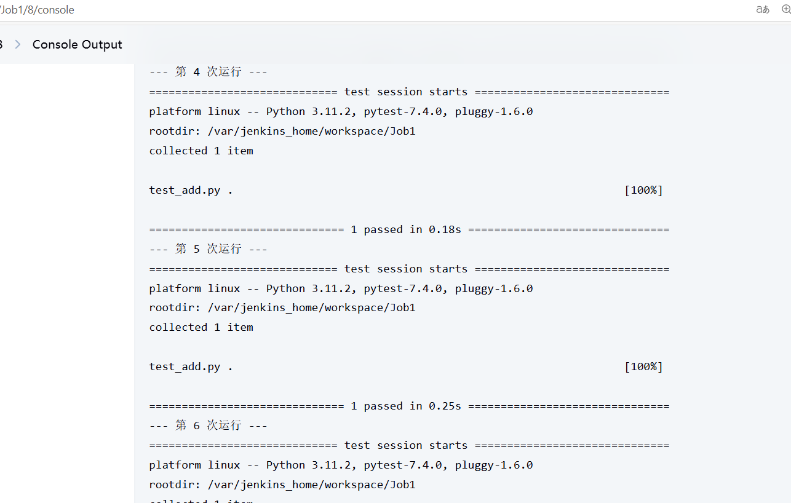
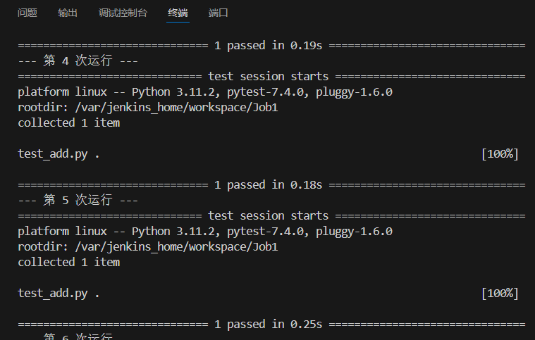
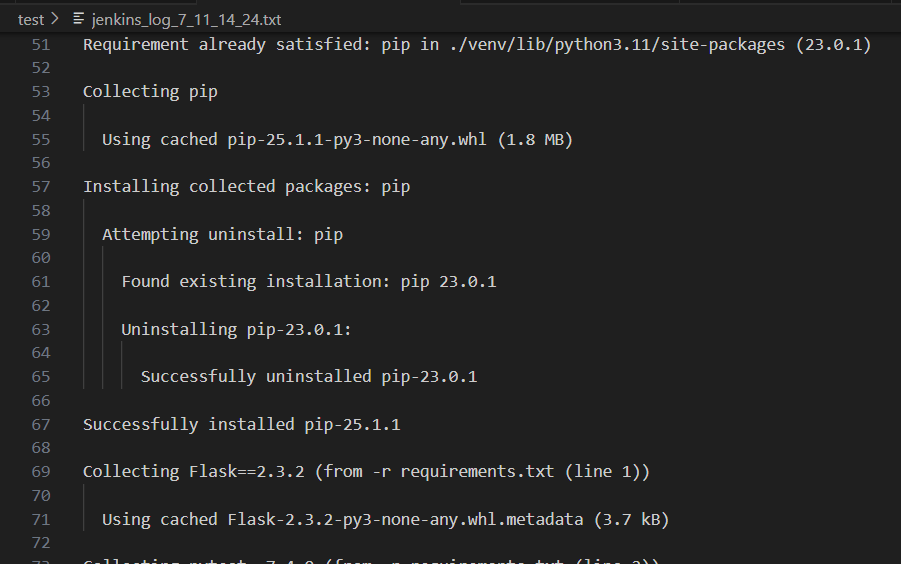
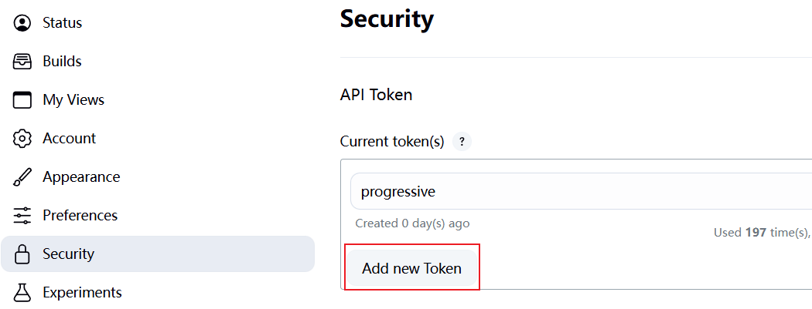

# Jenkins 日志实时监控方案

## 背景

在 Jenkins 上执行 Job时，实时产生的日志只能通过 Jenkins 的 Web UI 页面查看，不便于自动监控和分析。

## 方法一（不可行）：轮询 Jenkins Web UI 日志页面

尝试通过浏览器中的日志页面地址轮询日志内容，存在以下问题：

- 由于日志量是不断增长的, 无法获得完整且实时的日志, 不适合单行日志粒度的实时监控和分析

## 方法二（可行）：使用 progressiveText API 获取实时日志

通过 Jenkins 的 `progressiveText` API（分段日志接口）+ HTTP 请求：

- HTTP 轮询 `progressiveText` 接口是目前 Jenkins 官方支持的最靠谱方式；
- 可以实时获取不断增长的日志内容；
- 可与本地脚本完美结合，实现实时监控。


## 请求示例

以我的一个接口测试为例, 实时获取Jenkins日志：
```python
import requests
from requests.auth import HTTPBasicAuth
import time
from datetime import datetime

now = datetime.now()

JENKINS_URL = "http://localhost:8081"
JOB_NAME = "JOB_NAME"
BUILD_NUMBER = "BUILD_NUMBER"
USERNAME = "USERNAME"
API_TOKEN = "API_TOKEN"  

start = 0
headers = {}
log_file = f"jenkins_log_{now.month}_{now.day}_{now.hour}_{now.minute}.txt"

while True:
    url = f"{JENKINS_URL}/job/{JOB_NAME}/{BUILD_NUMBER}/logText/progressiveText?start={start}"
    response = requests.get(url, auth=HTTPBasicAuth(USERNAME, API_TOKEN), headers=headers)

    if response.status_code == 200:
        text = response.text
        if text:
            with open(log_file, "a", encoding="utf-8") as f:
                f.write(text)
            print(text, end="")  # 实时打印
        start = int(response.headers.get("X-Text-Size", start))

        more_data = response.headers.get("X-More-Data", "false").lower() == "true"
        if not more_data:
            print("\n[构建日志已完成！]")
            break
        time.sleep(1)
    else:
        print("请求失败：", response.status_code)
        break

```

## 结果
这样我们能够在终端或.txt中实时获得日志. 接下来就很多东西可以做了, 通过 `tail -f` + `grep`：本地实时监控日志中的关键字, 交给给Python 脚本还能实现更多复的功能, 比如异常和错误报警、问题复现提醒、性能数据采集等。







## 注意事项

- 轮询频率不应过高, 频繁请求会增加 Jenkins 主机压力, 或者日志量很大, 有十几万行, 应通过time.sleep()来减轻Jenkins 主机压力
- 请求参数BUILD_NUMBER设置为LastBuild, 获得你最新的一个job build的日志, 也可以填写具体的build号
- 参数USERNAME在Jenkins的Status查看, 不是用户名! 是Jenkins User ID
- 参数API_TOKEN在Jenkins的Security获得


